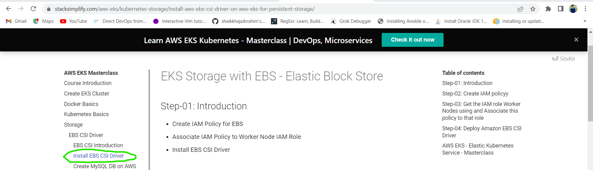

## Installing 'CSI' driver in EKS('Elastic Kubernetes Service'):
----------------------------------------------------------------
[Refer Here](https://www.stacksimplify.com/aws-eks/kubernetes-storage/create-kubernetes-storageclass-persistentvolumeclain-configmap-for-mysql-database/) for the documentation which i followed for the installation of CSI driver in EKS.

* Navigate to 'Install EBS CSI Driver' in the above reference and follow the procedure.

