## Installing 'CSI' driver in EKS('Elastic Kubernetes Service'):
----------------------------------------------------------------
[Refer Here](https://www.stacksimplify.com/aws-eks/kubernetes-storage/create-kubernetes-storageclass-persistentvolumeclain-configmap-for-mysql-database/) for the documentation which i followed for the installation of CSI driver in EKS.

* Navigate to 'Install EBS CSI Driver' in the above reference and follow the procedure.

* Create an IAM policy and attach it the nodes of eks(attach to role).
    * Role is the policy which we gives the permissions for one AWS service to access another AWS service.
* Policy to be used
```json
{
  "Version": "2012-10-17",
  "Statement": [
    {
      "Effect": "Allow",
      "Action": [
        "ec2:AttachVolume",
        "ec2:CreateSnapshot",
        "ec2:CreateTags",
        "ec2:CreateVolume",
        "ec2:DeleteSnapshot",
        "ec2:DeleteTags",
        "ec2:DeleteVolume",
        "ec2:DescribeInstances",
        "ec2:DescribeSnapshots",
        "ec2:DescribeTags",
        "ec2:DescribeVolumes",
        "ec2:DetachVolume"
      ],
      "Resource": "*"
    }
  ]
}
```  
* cretae the policy and attach it
   * for creating the policy we use IAM service in AWS
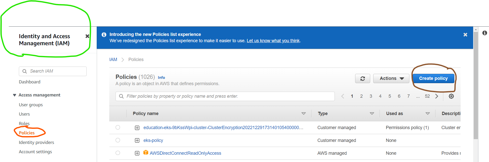
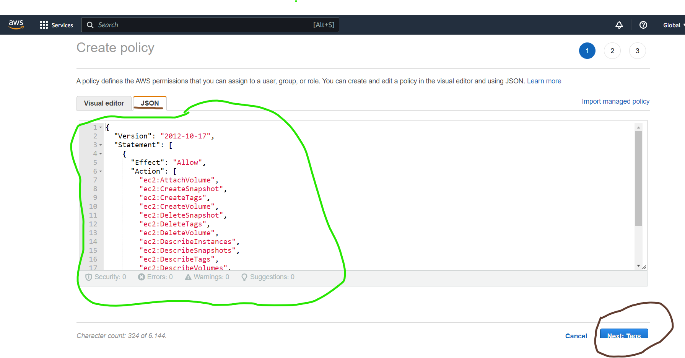
Now give a name to the policy and create the policy
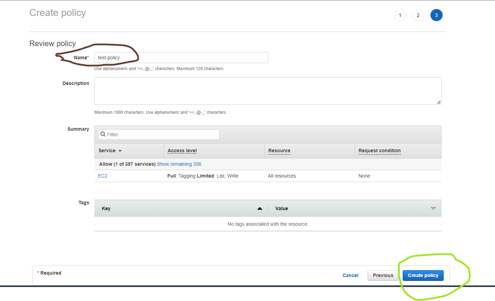
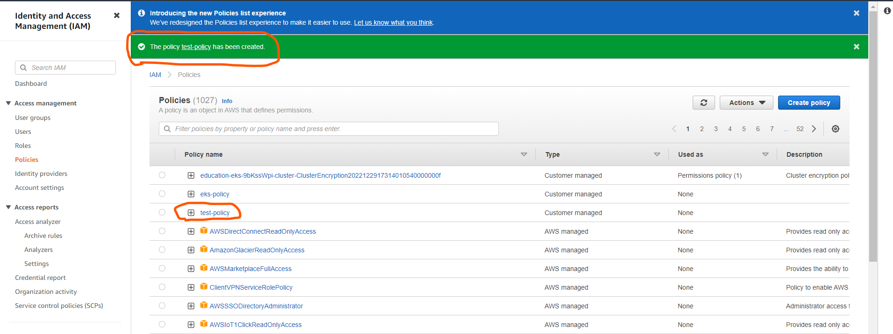
* Then get the arn of each node using `kubectl -n kube-system describe configmap aws-auth` and attach the policy to the respected arn of the nodes.
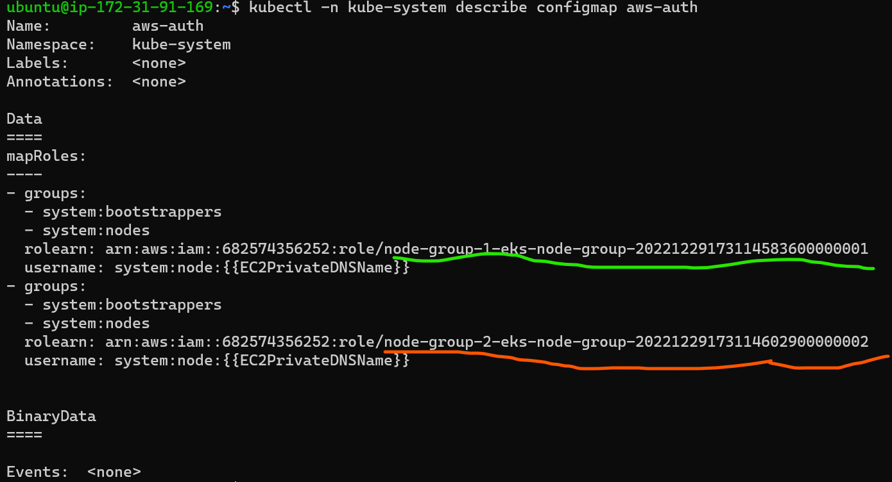
* Now we have to attach the policy which we created to the nodes with the arn of respective nodes
* Search in the roles with the arn of node one after another then select the role 
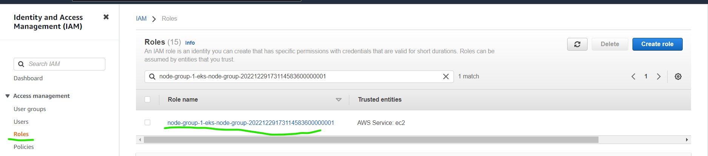
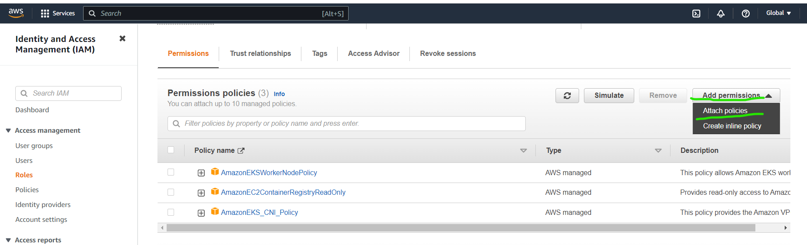
* Then select the policy which we created and attach it
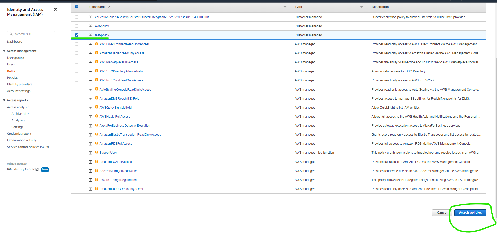
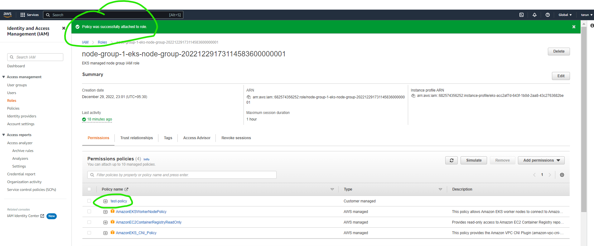
* Do the same for every node in the cluster
* Now install the CSI driver using
`kubectl apply -k "github.com/kubernetes-sigs/aws-ebs-csi-driver/deploy/kubernetes/overlays/stable/?ref=master"`
* The above command created pods which are required for CSI 
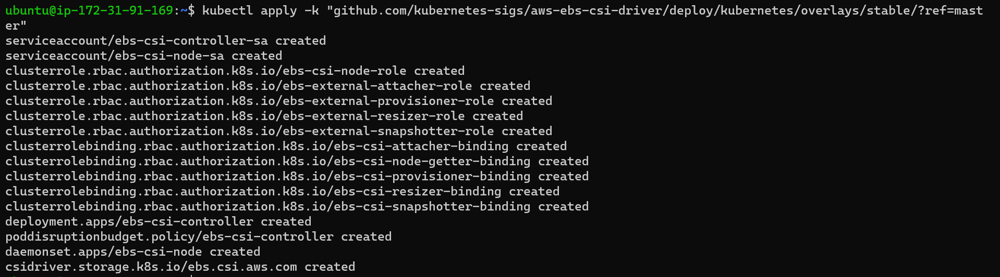
* Now verify weather they(the pods) were running or not using `kubectl get pods -n kube-system`
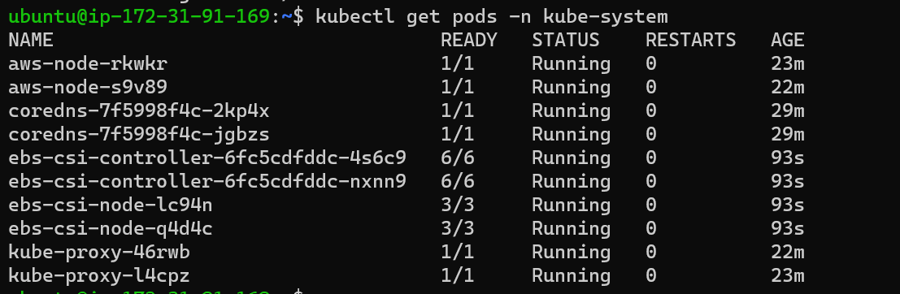
* After installing CSI driver now create a storage class which we can use it to create volmes
* Manifest for creating `StorageClass` from the document
```yaml
apiVersion: storage.k8s.io/v1
kind: StorageClass
metadata: 
  name: ebs-sc
provisioner: ebs.csi.aws.com
volumeBindingMode: Immediate 
```
* Now apply the manifest and check for created storage class.
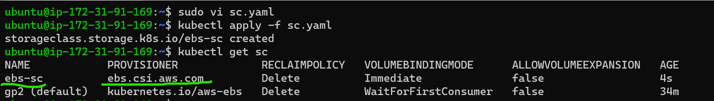

* Now try to create a PersistentVolumeClaim with the storage class which we created above
* Manifest for creating PersistentVolumeClaim(PVC)
```yaml
---
apiVersion: v1
kind: PersistentVolumeClaim
metadata:
  name: saleor-pvc
spec:
  storageClassName: ebs-sc
  accessModes:
    - ReadWriteOnce
  resources:   
    requests:
      storage: 1Gi
```
* Apply the manifest and check for the created PVC
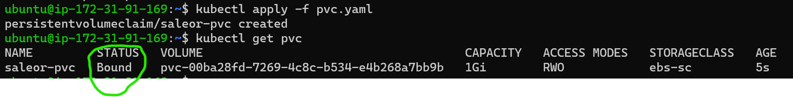


## Installing Ingress controller in eks:
----------------------------------------
[Refer Here](https://www.stacksimplify.com/aws-eks/aws-alb-ingress/aws-install-alb-ingress-controller-on-aws-eks-cluster/) for the documentation for installing ingress controller
