## Installing nginx Ingress controller in 'EKS':
------------------------------------------------
[ Refer Here](https://aws.amazon.com/premiumsupport/knowledge-center/eks-access-kubernetes-services/) for the documentation which i followed to install ingress-controller in eks.
* Apply `wget https://raw.githubusercontent.com/kubernetes/ingress-nginx/main/deploy/static/provider/aws/deploy.yaml` to deploy `namespace, serviceaccounts, configmap, clusterroles, clusterrolebindings, roles, rolebindings, services, deployments, ingressclasses, and validatingwebhookconfigurations.`
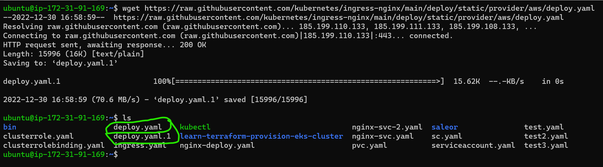
* Apply the manifest
`kubectl apply -f deploy.yaml`
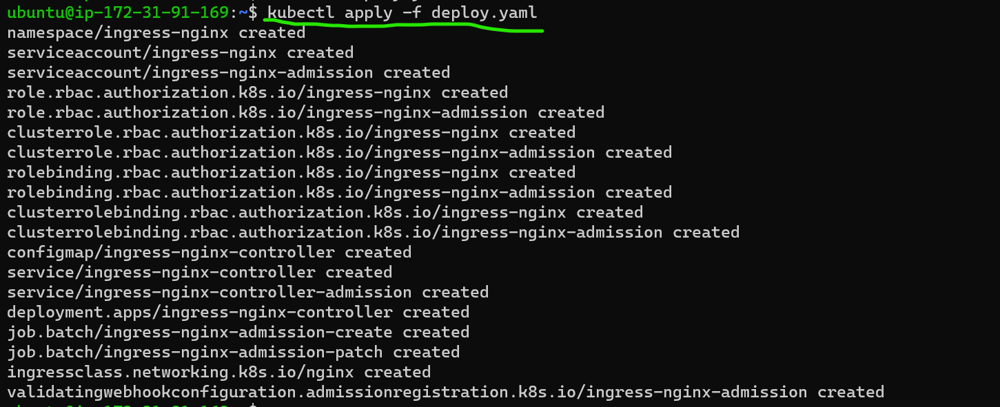
* Verify the deployed resources using for nginx-ingress controller `kubectl get all -n ingress-nginx --selector app.kubernetes.io/instance=ingress-nginx`
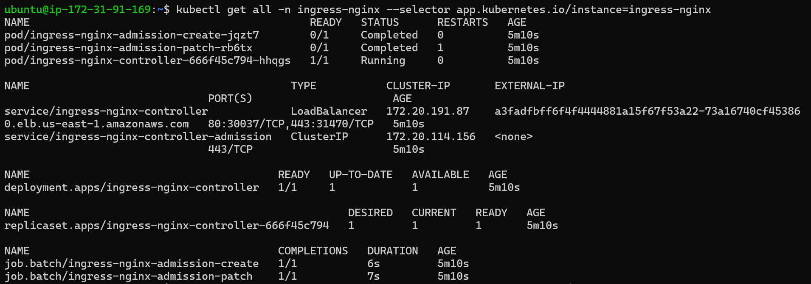
* For ingressclass use `kubectl get ingressclass`
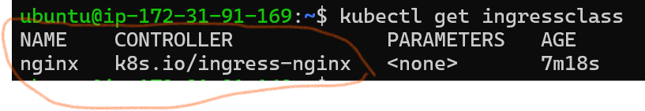
* Lets deploy two sample applications with service
  * Deployment-1:
     * hostname-app  
* Manifest for deployment
```yaml
apiVersion: apps/v1 
kind: Deployment 
metadata:
  name: hostname-app
  namespace: default 
spec:
  replicas: 2
  selector:
    matchLabels:
      app: hostname-app
  template:
    metadata:
      labels:
        app: hostname-app
    spec:
      containers:
      - name: hostname-app
        image: k8s.gcr.io/serve_hostname:1.1 
```

* Manifest for hostname-app service
```yaml
--- 
apiVersion: v1 
kind: Service 
metadata:
  name: hostname-svc
  namespace: default 
spec:
  ports:
  - port: 80
    targetPort: 9376
    protocol: TCP
  selector:
    app: hostname-app
```
* Apply the manifests
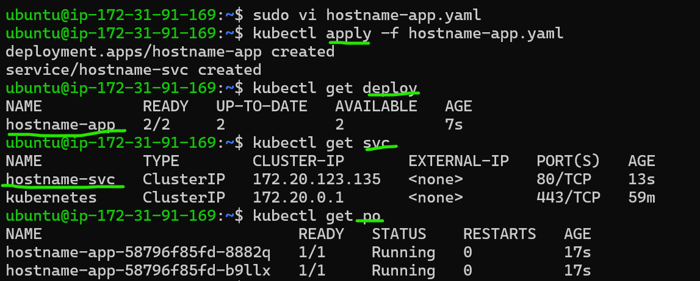

* Do the process for another application ( here using apache)

* Manifest for apache2 deployment
```yaml
apiVersion: apps/v1 
kind: Deployment 
metadata:
  name: apache-app
  namespace: default 
spec:
  replicas: 2
  selector:
    matchLabels:
      app: apache-app
  template:
    metadata:
      labels:
        app: apache-app
    spec:
      containers:
      - name: apache-app
        image: httpd:latest
        ports:
        - containerPort: 80 
```
* Manifest for apache2 service
```yaml
--- 
apiVersion: v1 
kind: Service 
metadata:
  name: apache-svc
  namespace: default
  labels: 
spec:
  ports:
  - port: 80
    targetPort: 80
    protocol: TCP
  selector:
    app: apache-app
```
* Apply the manifest
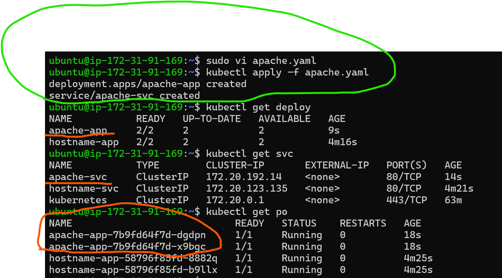

* We can also check the deployments and services which we created in default namespace using
deploment: `kubectl get deployment hostname-app apache-app -n default`
service: `kubectl get svc apache-svc hostname-svc -n default`
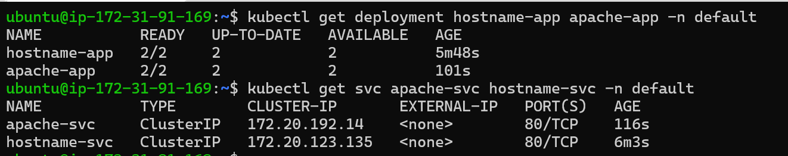
* Now get dns of the service which we created using `kubectl get svc -A` which gives available services in all the namespaces with in the kubernetes cluster then try to ping using `curl` with the dns
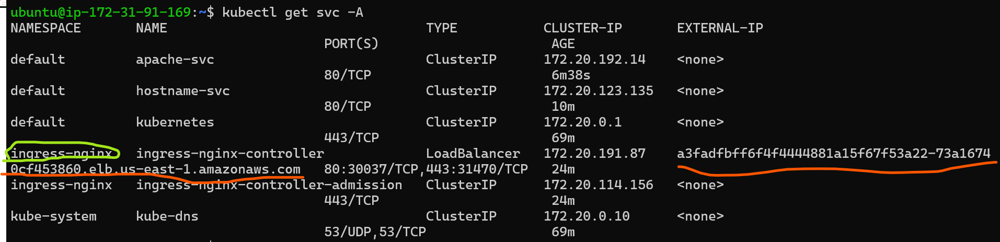
`curl -I a3fadfbff6f4f4444881a15f67f53a22-73a16740cf453860.elb.us-east-1.amazonaws.com`
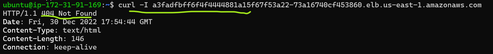
* Here we got an error because for all domain requests that don't have defined ingress rules to fix this we need to write ingress that it interfaces with your services using a single load balancer provided by the NGINX ingress controller
* Manifest for creating ingress
```yaml
apiVersion: networking.k8s.io/v1 
kind: Ingress 
metadata:
  name: micro-ingress
  namespace: default
  annotations: 
    kubernetes.io/ingress.class: nginx 
spec:
  rules:
    - host: hostname.mydomain.com
      http:
        paths:
        - backend:
            service:
              name: hostname-svc
              port:
                number: 80
          path: /
          pathType: Prefix
  - host: apache.mydomain.com
    http:
      paths:
      - backend:
          service:
            name: apache-svc
            port:
              number: 80
        path: /
        pathType: Prefix
```
* Apply the manifest and check what it created
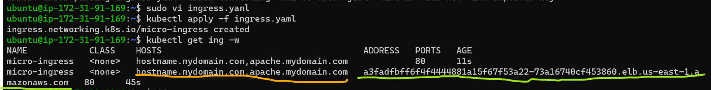
          (or)
`kubectl get ingress -n default`
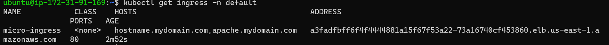
* Now try ping the dns name using `curl` from localhost(from git bash in our pc) with the hosts which we created as part of our ingress creation if the output gives you `200` then it is working but to access it we need to create an alias name. 
hosts: `hostname.mydomain.com`  `apache.mydomain.com`
dns in my case: `a3fadfbff6f4f4444881a15f67f53a22-73a16740cf453860.elb.us-east-1.amazonaws.com`
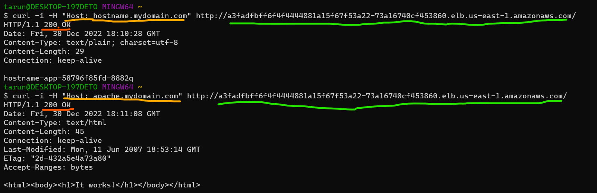

Errors so far:
--------------
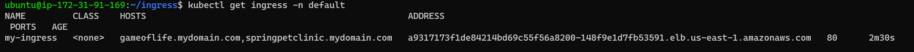
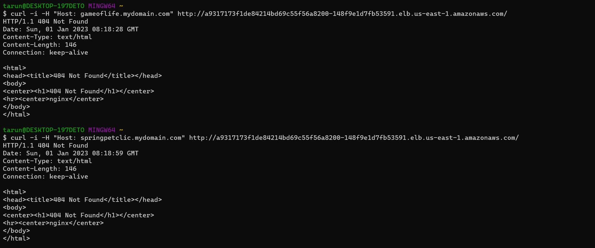
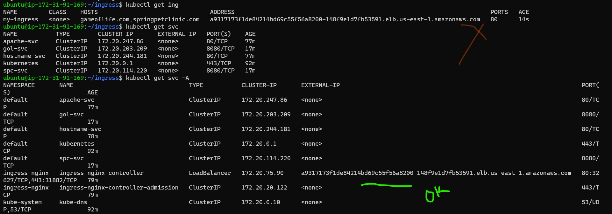
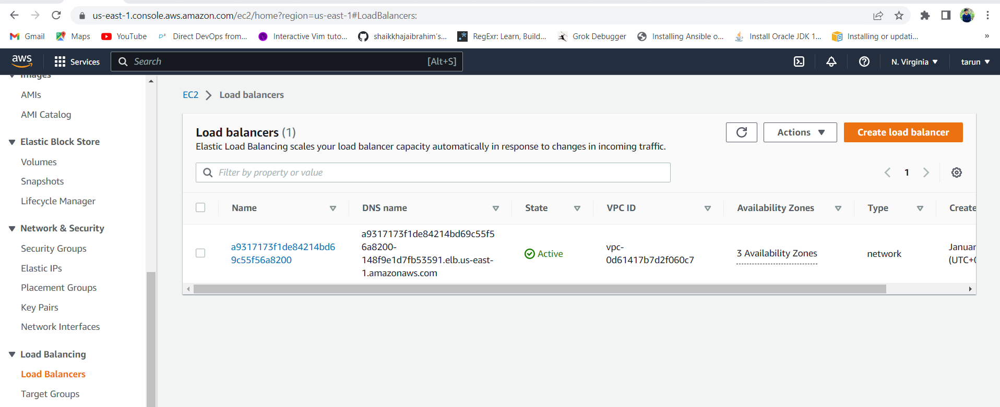