### Game of life:
-----------------
* First of all i created a docker image for gameoflife application and created a tag for the image which i build to push it to registry and then pushed the image to dockerhub registry from Jenkins and i have written Dockerfile to build the image
```Dockerfile
FROM tomcat:8-jdk8 as tarun
RUN apt update \
    && apt install maven git -y \ 
    && git clone https://github.com/wakaleo/game-of-life.git \
    && cd game-of-life \
    && mvn clean install \
    && cp /usr/local/tomcat/game-of-life/gameoflife-web/target/gameoflife.war /usr/local/tomcat/webapps/gameoflife.war 
EXPOSE 8080
CMD [ "catalina.sh", "run" ]    
```

```groovy
pipeline{
    agent{
        label 'node-1'
    }
    stages{
        stage('clone'){
            steps{
                sh """
                      docker image build -t gol:1.0 .
                      docker image tag gol:1.0 tarunkumarpendem/gol:1.0
                      docker image push tarunkumarpendem/gol:1.0
                    """   
            }
        }
    }
}
```
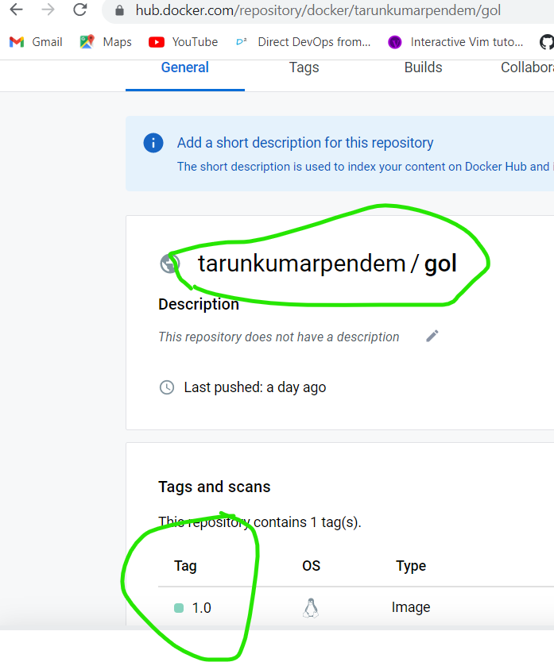
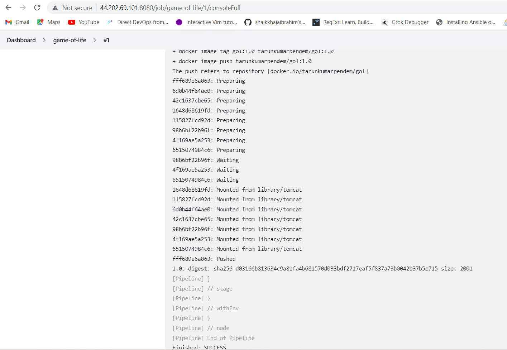
* After the successful containarization of  the application manually.

  
* Then i tried deploy the applcation from kubernetes(K8s) For that we need to write the manifests

The manifest written to deploy game of life:
--------------------------------------------
```yaml
---
apiVersion: apps/v1
kind: Deployment
metadata:
  name: game-of-life
  labels:
    name: gameoflife
    version: jdk8
spec:
  minReadySeconds: 5
  replicas: 1
  selector:
    matchLabels:
      name: gameoflife
  strategy:
    type: RollingUpdate
    rollingUpdate:
      maxSurge: 25%
      maxUnavailable: 25%
  template:
    metadata:
      name: game-of-life
      labels:
        name: gameoflife
        version: jdk8
    spec:
      containers:
        - image: tarunkumarpendem/gol:1.0 
          name: game-of-life
          ports:
            - containerPort: 8080
              protocol: TCP
```
* To access the application within/outside of the K8s cluster we need write the K8s workload service
  
The manifest written for gameoflife service:
-------------------------------------
```yaml
---
apiVersion: v1
kind: Service
metadata: 
  name: gameoflife-svc
  labels:
    app: gameoflife
spec:
  type: LoadBalancer
  selector:
    app: gameoflife
  ports:
    - port: 8080
      name: gameoflife-webport
``` 
* Then appply these yaml files to create deployments and services from K8s cluster
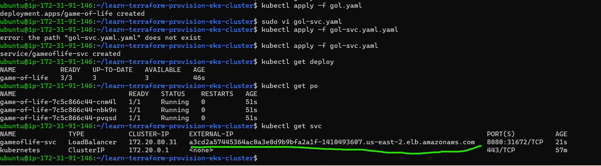
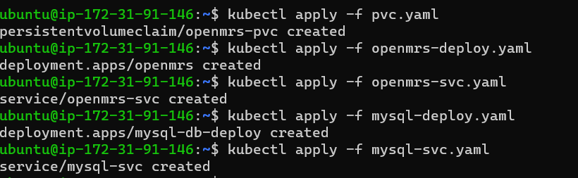
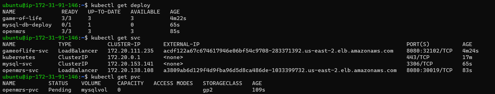
* Then we can access the application with the dns name of the load balancer which is created from the service manifest which we written


### SpringPetClinic:
--------------------
* First of all i created a docker image for springpetclinic application and created a tag for the image which i build to push it to registry and then pushed the image to dockerhub registry from Jenkins and i have written Dockerfile to build the image
```Dockerfile
FROM amazoncorretto:11
ADD https://referenceapplicationskhaja.s3.us-west-2.amazonaws.com/spring-petclinic-2.4.2.jar .
EXPOSE 8080
CMD ["java", "-jar", "/spring-petclinic-2.4.2.jar"]    
```

```groovy
pipeline{
    agent{
        label 'node-1'
    }
    stages{
        stage('clone'){
            steps{
                git url: 'https://github.com/tarunkumarpendem/spring-petclinic.git',
                    branch: 'main'
            }
        }
        stage('build and push'){
            steps{
                sh """
                      docker image build -t spc:1.0 .
                      docker image tag spc:1.0 tarunkumarpendem/spc:1.0
                      docker image push tarunkumarpendem/spc:1.0
                    """  
            }
        }
    }
}
```
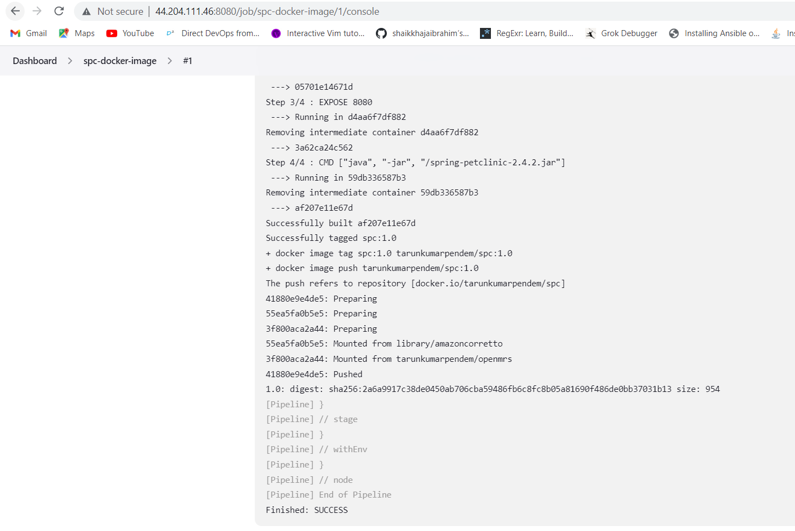
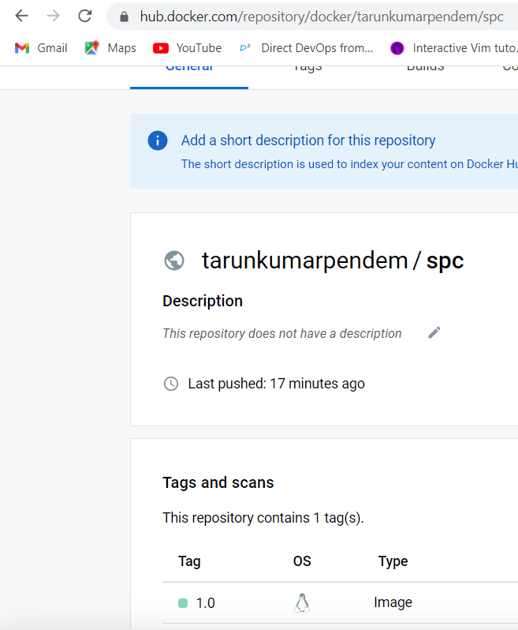
* After the successful containarization of  the application manually.
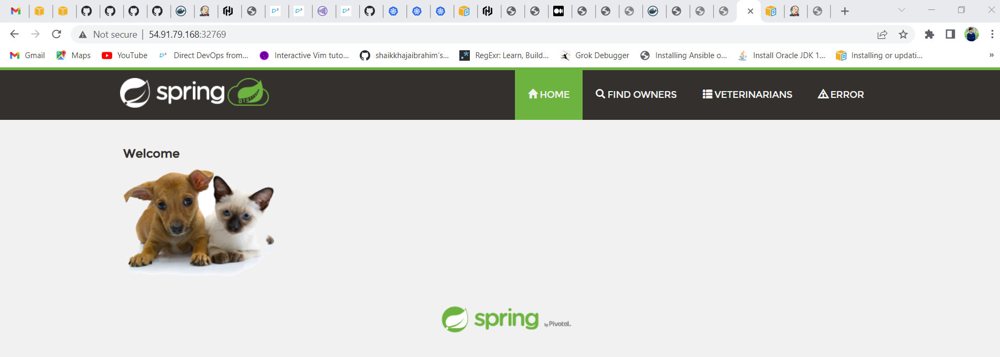
  
* Then i tried deploy the applcation from kubernetes(K8s) For that we need to write the manifests

The manifest written to deploy Spring-Petclinic:
--------------------------------------------
```yaml
---
apiVersion: apps/v1
kind: Deployment
metadata:
  name: spring-petclinic
  labels:
    name: spring-petclinic
spec:
  minReadySeconds: 5
  replicas: 1
  selector:
    matchLabels:
      name: spring-petclinic
  strategy:
    type: RollingUpdate
    rollingUpdate:
      maxSurge: 25%
      maxUnavailable: 25%
  template:
    metadata: 
      name: spring-petclinic
      labels:
        name: spring-petclinic
    spec:
      containers:
        - image: tarunkumarpendem/spc:1.0
          name: spring-petclinic
          ports:
            - containerPort: 8080
              protocol: TCP
```
* To access the application within/outside of the K8s cluster we need write the K8s workload service
  
The manifest written for Spring-petclinic service:
-------------------------------------
```yaml
---
apiVersion: v1
kind: Service
metadata: 
  name: spring-petclinic-svc
  labels:
    app: spring-petclinic
spec:
  type: LoadBalancer
  selector:
    app: spring-petclinic
  ports:
    - port: 8080
      name: spring-petclinic-webport     
``` 
* Then appply these yaml files to create deployments and services from K8s cluster

* Then we can access the application with the dns name of the load balancer which is created from the service manifest which we written


-----
### Openmrs:
------------
* First of all like game fo life i created a docker image for openmrs application and created a tag for the image which i build to push it to registry and then pushed the image to dockerhub registry from Jenkins and i have written Dockerfile to build the image
```Dockerfile
FROM maven:3-jdk-8 as build
RUN git clone https://github.com/tarunkumarpendem/openmrs-core.git && \
    cd openmrs-core && \
    mvn package

# Dockerfile ,,,Openmrs run i,e stage-2
#war file location: /openmrs-core/webapp/target/openmrs.war
FROM tomcat:8-jdk11
LABEL application="openmrs"
LABEL owner="Tarun"
COPY --from=build /openmrs-core/webapp/target/openmrs.war /usr/local/tomcat/webapps/openmrs.war
EXPOSE 8080
CMD ["catalina.sh", "run"]    
```

```groovy
pipeline{
    agent {
        label 'node-2'
    }
    stages{
        stage('clone'){
            steps{
                sh """
                      docker image build -t openmrs:1.1 .
                      docker image tag openmrs:1.1 tarunkumarpendem/openmrs:1.1
                      docker image push tarunkumarpendem/openmrs:1.1
                    """   
            }
        }
    }
}
```
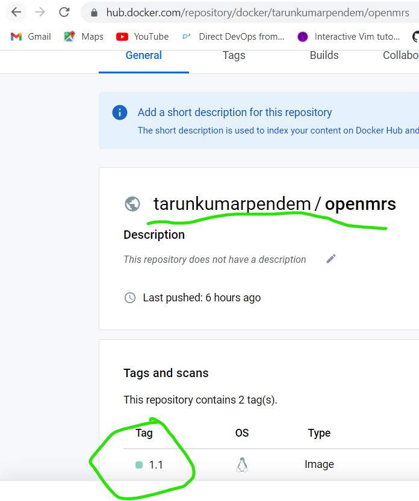
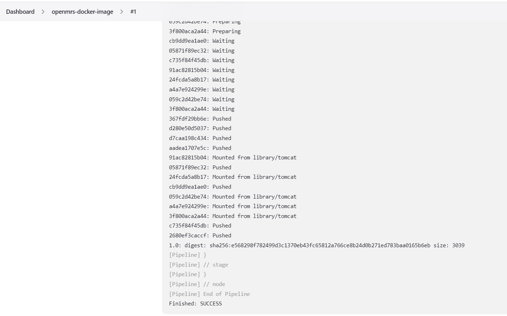
* After the successful containarization of  the application manually.
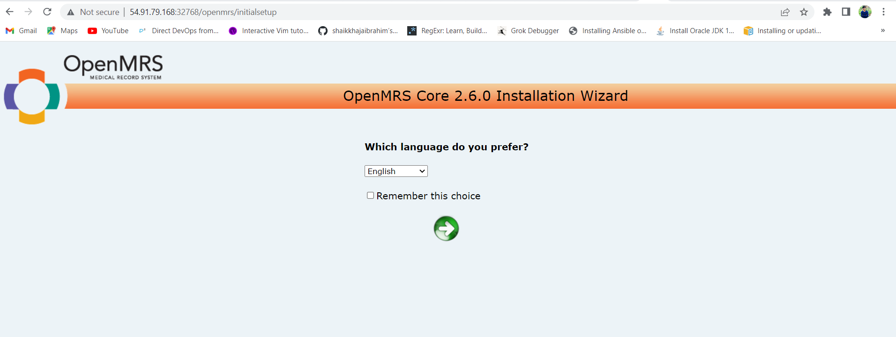
  
* Then i tried deploy the applcation from kubernetes(K8s) For that we need to write the manifests a database deployment and service is also requied (but not nescessary to run this application) for this openmrs and for database it generally has a volume for that i created a PersistentVolumeClaims and attached it to mysql database 

The manifest written to deploy openmrs:
--------------------------------------------
```yaml
---
apiVersion: apps/v1
kind: Deployment
metadata:
  name: openmrs
  labels:
    name: openmrs
spec:
  minReadySeconds: 5
  replicas: 3
  selector:
    matchLabels:
      name: openmrs
  strategy:
    type: RollingUpdate
    rollingUpdate:
      maxSurge: 25%
      maxUnavailable: 25%
  template:
    metadata:
      name: openmrs
      labels:
        name: openmrs
    spec:
      containers:
        - image: tarunkumarpendem/openmrs:1.1 
          name: openmrs
          ports:
            - containerPort: 8080
              protocol: TCP
```
* To access the application within/outside of the K8s cluster we need write the K8s workload service
  
The manifest written for openmrs service:
-------------------------------------
```yaml
---
apiVersion: v1
kind: Service
metadata: 
  name: openmrs-svc
  labels:
    app: openmrs
    type: service
spec:
  type: LoadBalancer
  selector:
    name: openmrs
  ports:
    - port: 8080
      name: openmrs-web-port
``` 

Manifest written to create PersistentVolumeClaim(PVC):
------------------------------------------------------
```yaml
---
apiVersion: v1
kind: PersistentVolumeClaim
metadata:
  name: openmrs-pvc
  labels:
    app: openmrs
spec:
  selector:
    matchLabels:
      app: openmrs
  storageClassName: gp2
  accessModes:
    - ReadWriteMany
  volumeName: mysqlvol
  resources:   
    requests:
      storage: 1Gi      
```
Manifest for deploying mysql database:
--------------------------------------
```yaml
---
apiVersion: apps/v1
kind: Deployment
metadata:
  name: mysql-db-deploy
  labels:
    db: mysql
    name: mysql-db-deploy
spec:
  minReadySeconds: 10
  replicas: 1
  selector:
    matchLabels:
      name: mysql-db-deploy
  strategy:
    type: RollingUpdate
    rollingUpdate:
      maxSurge: 25%
      maxUnavailable: 25%
  template:
    metadata:
      name: mysql-db-deploy
      labels:
        db: mysql
        name: mysql-db-deploy
    spec:
      containers:
        - image: mysql:8.0.31-debian
          name: mysql-db 
          ports:
            - containerPort: 3306
              protocol: TCP
          volumeMounts:
            - mountPath: /var/lib/mysql
              name: mysql-pvc-vol
      volumes: 
        - name: mysql-pvc-vol
          persistentVolumeClaim: 
            claimName: openmrs-pvc                  
```

Manifest written for mysql database service but here it (mysql-db) doesn't need to expose to outside world(outside of K8s Cluster) so we can use ClusterIp type
```yaml
---
apiVersion: v1
kind: Service
metadata: 
  name: mysql-svc
  labels:
    db: mysql
    type: service
spec:
  type: ClusterIP
  selector:
    db: mysql
    name: mysql-db-deploy
  ports:
    - port: 3306
      name: mysql-port
```
* Then appply these yaml files to create Deployments, Volumes and Services from K8s cluster


* Then we can access the application with the dns name of the load balancer which is created from the service manifest which we written
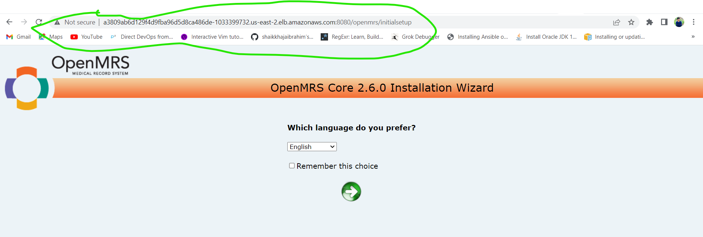


### K8s Ingress workload:
-------------------------
* Ingress:
      *  When we need path based or hostname based routing we can use ingress
      *  Ingress supports layer7 lb with in k8s cluster but to expose this functionality outside of k8s cluster it needs ingress controller

Manifest written to create Ingress for openmrs and game of life applications:
------------------------------------------------------------------------------
```yaml
---
apiVersion: apps/v1
metadata:
  name: game-of-life-deploy
  labels: 
    app1: game-of-life-deploy
kind: Deployment
spec:
  minReadySeconds: 3
  replicas: 1
  selector:
    matchLabels:
      app1: game-of-life-deploy
  strategy:
    type: RollingUpdate
    rollingUpdate:
      maxSurge: 25%
      maxUnavailable: 25%
  template:
    metadata:
      name: game-of-life-deploy
      labels:
        app1: game-of-life-deploy
    spec:
      containers:
        - image: tarunkumarpendem/gol:1.0
          name: game-of-life
          ports:
            - containerPort: 8080
              protocol: TCP

---
apiVersion: apps/v1
metadata:
  name: openmrs-deploy 
  labels: 
    app2: openmrs-deploy
kind: Deployment
spec:
  minReadySeconds: 3
  replicas: 1
  selector:
    matchLabels:
      app2: openmrs-deploy
  strategy:
    type: RollingUpdate
    rollingUpdate:
      maxSurge: 25%
      maxUnavailable: 25%
  template:
    metadata:
      name: openmrs-deploy
      labels:
        app2: openmrs-deploy
    spec:
      containers:
        - image: tarunkumarpendem/openmrs:1.1
          name: openmrs
          ports:
            - containerPort: 8080
              protocol: TCP              
        


---
apiVersion: v1
kind: Service
metadata:
  name: apps-svc
  labels:
    name: apps-svc
spec:
  ports:
    - port: 10000
      targetPort: 8080
      protocol: TCP
      name: apps-webport-1
    - port: 20000
      targetPort: 8080
      protocol: TCP
      name: apps-webport-2  
  selector:
    app1: game-of-life-deploy 
    app2: openmrs-deploy
  type: LoadBalancer  


---
apiVersion: networking.k8s.io/v1
kind: Ingress
metadata:
  name: ingress
  annotations:
    kubernetes.io/ingress.class: service.beta.kubernetes.io/aws-load-balancer-healthcheck-path
spec:
  rules:
    - host: openmrs-gol-spc-ingress
      http:
        paths:
          - path: /gameoflife
            backend:
              service:
                name: apps-svc
                port:
                  number: 10000
            pathType: Exact
          - path: /openmrs
            backend:
              service:
                name: apps-svc
                port:
                  number: 20000
            pathType: Exact                                             
```
* Apply the manifest and check for workloads it created
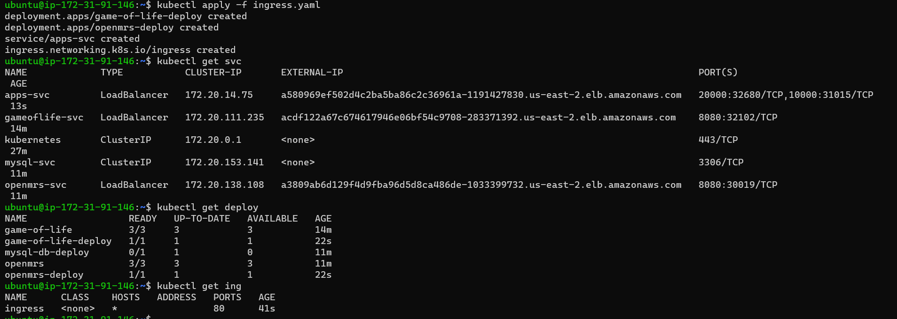
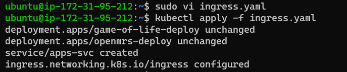
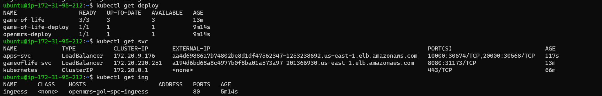
* Try to access the applications

Here ingress is created but it doesn't gave ExternalIp which i need to clarify

Errors:
-------
* The following error in the EKS is getting repeated again and again which need to be fixed but the probelm is even though the instances are running fine and load balancers getting created but still the instances attached to load balancers are in OutOfService state which should be cleared
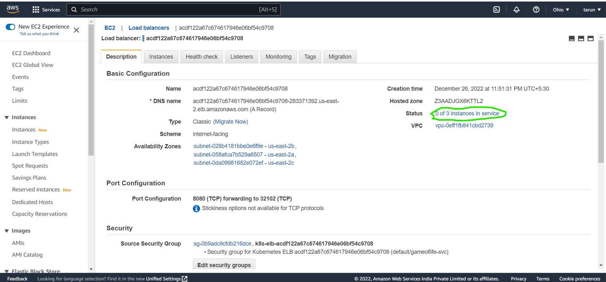 


Because of the above error i'm getting till only this 


## Saleor-core:
---------------
* Manually trying to containarize the python based application saleor-core
    steps:
    ------
    * clone the repo `git clone https://github.com/saleor/saleor-platform.git --recursive --jobs 3`
    * cd to the folder `cd saleor-platform`
    * build the code using docker compose `docker compose build`
    * then follow the below steps to containarize the application
    `docker compose run --rm api python3 manage.py migrate`
    `docker compose run --rm api python3 manage.py collectstatic --noinput`
    `docker compose run --rm api python3 manage.py populatedb`
    `docker compose run --rm api python3 manage.py createsuperuser`
    `docker compose up -d`
* then access the application 
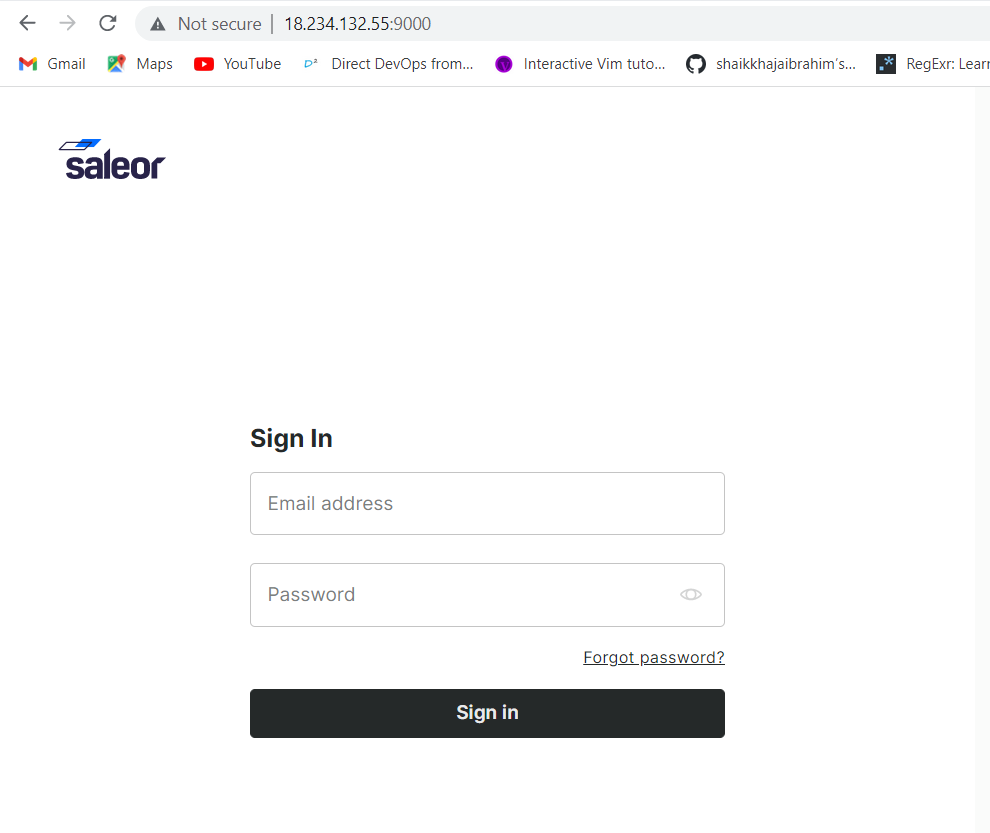

* Now build the image for saleor-dashboard and push it to dockerhub from jenkins
clone the code from `https://github.com/saleor/saleor-dashboard.git` then cd into it `cd saleor-dashboard` then build and push the image from the Dockerfile in the repo doing this from jenkins
```Dockerfile
FROM node:18-alpine as builder
WORKDIR /app
COPY package*.json ./
COPY scripts/patchReactVirtualized.js scripts/
ENV CI 1
RUN npm ci --omit=optional --legacy-peer-deps

COPY nginx/ nginx/
COPY assets/ assets/
COPY locale/ locale/
COPY scripts/removeSourcemaps.js scripts/
COPY codegen.yml ./
COPY vite.config.js ./
COPY tsconfig.json ./
COPY sw.js ./
COPY *.d.ts ./
COPY schema.graphql ./
COPY introspection.json ./
COPY src/ src/

ARG API_URI
ARG APP_MOUNT_URI
ARG MARKETPLACE_URL
ARG SALEOR_APPS_ENDPOINT
ARG STATIC_URL
ARG SKIP_SOURCEMAPS

ENV API_URI ${API_URI:-http://localhost:8000/graphql/}
ENV APP_MOUNT_URI ${APP_MOUNT_URI:-/dashboard/}
ENV MARKETPLACE_URL ${MARKETPLACE_URL}
ENV SALEOR_APPS_ENDPOINT=${SALEOR_APPS_ENDPOINT}
ENV STATIC_URL ${STATIC_URL:-/dashboard/}
ENV SKIP_SOURCEMAPS ${SKIP_SOURCEMAPS:-true}
RUN npm run build

FROM nginx:stable-alpine as runner
WORKDIR /app

COPY ./nginx/default.conf /etc/nginx/conf.d/default.conf
COPY ./nginx/replace-api-url.sh /docker-entrypoint.d/50-replace-api-url.sh
COPY --from=builder /app/build/ /app/

LABEL org.opencontainers.image.title="saleor/saleor-dashboard"                                  \
      org.opencontainers.image.description="A GraphQL-powered, single-page dashboard application for Saleor." \
      org.opencontainers.image.url="https://saleor.io/"                                \
      org.opencontainers.image.source="https://github.com/saleor/saleor-dashboard"     \
      org.opencontainers.image.revision="$COMMIT_ID"                                   \
      org.opencontainers.image.version="$PROJECT_VERSION"                              \
      org.opencontainers.image.authors="Saleor Commerce (https://saleor.io)"           \
      org.opencontainers.image.licenses="BSD 3"
```

```groovy
pipeline{
    agent{
        label 'node-1'
    }
    stages{
        stage('clone'){
            steps{
                git url: 'https://github.com/tarunkumarpendem/saleor-dashboard.git',
                    branch: 'dev'
            }
        }
        stage('docker_image_build'){
            steps{
                sh """
                      docker image build -t saleor-dashboard:dev .
                      docker image tag saleor-dashboard:dev tarunkumarpendem/saleor-dashboard:dev
                      docker image push tarunkumarpendem/saleor-dashboard:dev
                    """  
            }
        }
    } 
}
```
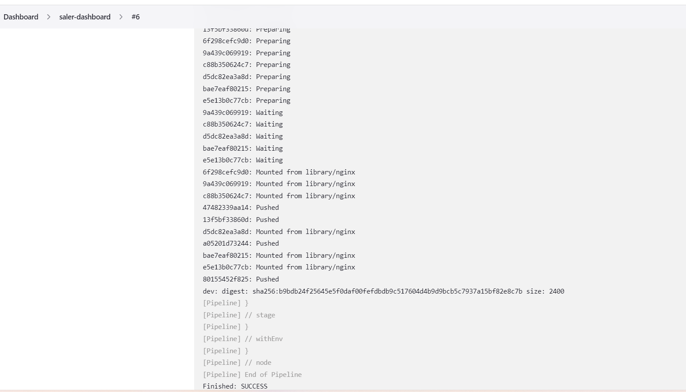
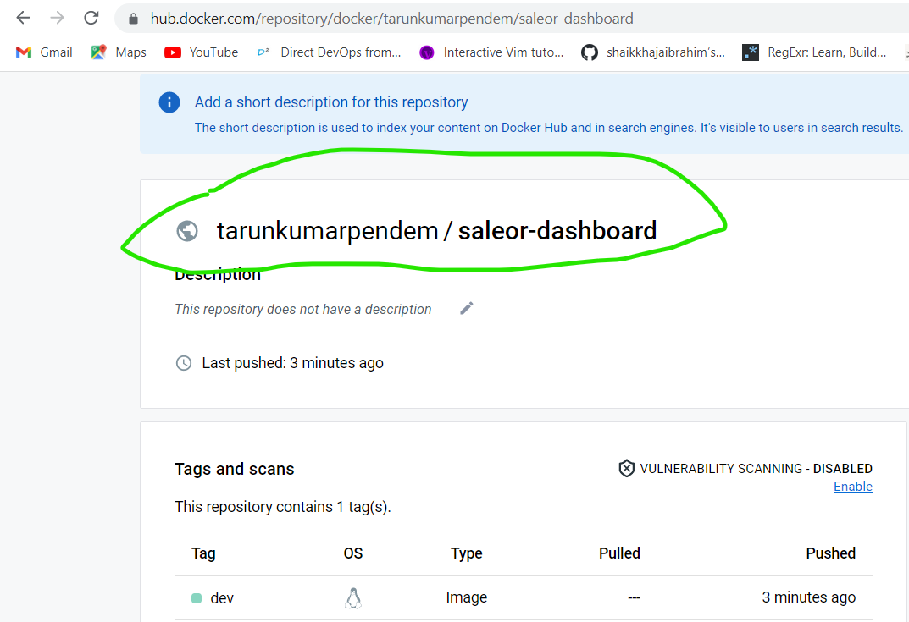
* then try to run the container with image which is pushed to dockerhub
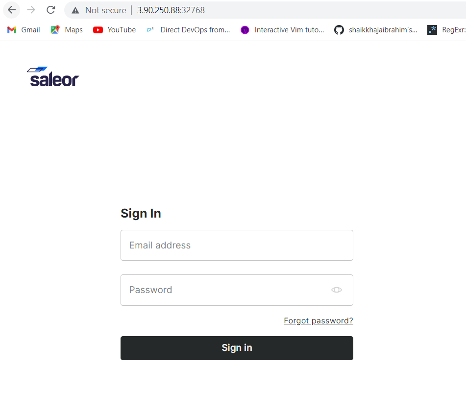

* Now do the same for saleor also
clone the code from `https://github.com/tarunkumarpendem/saleor.git`
then build the image from the Dokcerfile push it to registry as above from Jenkins
```Dockerfile
### Build and install packages
FROM python:3.9 as build-python

RUN apt-get -y update \
  && apt-get install -y gettext \
  # Cleanup apt cache
  && apt-get clean \
  && rm -rf /var/lib/apt/lists/*

# Install Python dependencies
COPY requirements_dev.txt /app/
WORKDIR /app
RUN pip install -r requirements_dev.txt

### Final image
FROM python:3.9-slim

RUN groupadd -r saleor && useradd -r -g saleor saleor

RUN apt-get update \
  && apt-get install -y \
  libcairo2 \
  libgdk-pixbuf2.0-0 \
  liblcms2-2 \
  libopenjp2-7 \
  libpango-1.0-0 \
  libpangocairo-1.0-0 \
  libssl1.1 \
  libtiff5 \
  libwebp6 \
  libxml2 \
  libpq5 \
  shared-mime-info \
  mime-support \
  && apt-get clean \
  && rm -rf /var/lib/apt/lists/*

RUN echo 'image/webp webp' >> /etc/mime.types

RUN mkdir -p /app/media /app/static \
  && chown -R saleor:saleor /app/

COPY --from=build-python /usr/local/lib/python3.9/site-packages/ /usr/local/lib/python3.9/site-packages/
COPY --from=build-python /usr/local/bin/ /usr/local/bin/
COPY . /app
WORKDIR /app

ARG STATIC_URL
ENV STATIC_URL ${STATIC_URL:-/static/}
RUN SECRET_KEY=dummy STATIC_URL=${STATIC_URL} python3 manage.py collectstatic --no-input

EXPOSE 8000
ENV PYTHONUNBUFFERED 1

ARG COMMIT_ID
ARG PROJECT_VERSION
ENV PROJECT_VERSION="${PROJECT_VERSION}"

LABEL org.opencontainers.image.title="mirumee/saleor"                                  \
      org.opencontainers.image.description="\
A modular, high performance, headless e-commerce platform built with Python, \
GraphQL, Django, and ReactJS."                                                         \
      org.opencontainers.image.url="https://saleor.io/"                                \
      org.opencontainers.image.source="https://github.com/saleor/saleor"               \
      org.opencontainers.image.revision="$COMMIT_ID"                                   \
      org.opencontainers.image.version="$PROJECT_VERSION"                              \
      org.opencontainers.image.authors="Saleor Commerce (https://saleor.io)"           \
      org.opencontainers.image.licenses="BSD 3"

CMD ["gunicorn", "--bind", ":8000", "--workers", "4", "--worker-class", "saleor.asgi.gunicorn_worker.UvicornWorker", "saleor.asgi:application"]
```
* Jenkins pipeline for building and pushing saleor image

```groovy
pipeline{
    triggers{
        pollSCM('* * * * *')
    }
    agent any
    stages{
        stage('clone'){
            agent{
                 label 'node-1'
            }
            steps{
                git url: 'https://github.com/tarunkumarpendem/saleor.git',
                    branch: 'dev'
            }
        }
        stage('docker_image_build and push'){
            agent{
                label 'node-1'
            }
            steps{
                sh """docker image build -t saleor-core:dev-1.0 .
                      docker image tag saleor-core:dev-1.0 tarunkumarpendem/saleor-core:dev-1.0
                      docker image push tarunkumarpendem/saleor-core:dev-1.0
                    """ 
            }
        }
    }
}
```
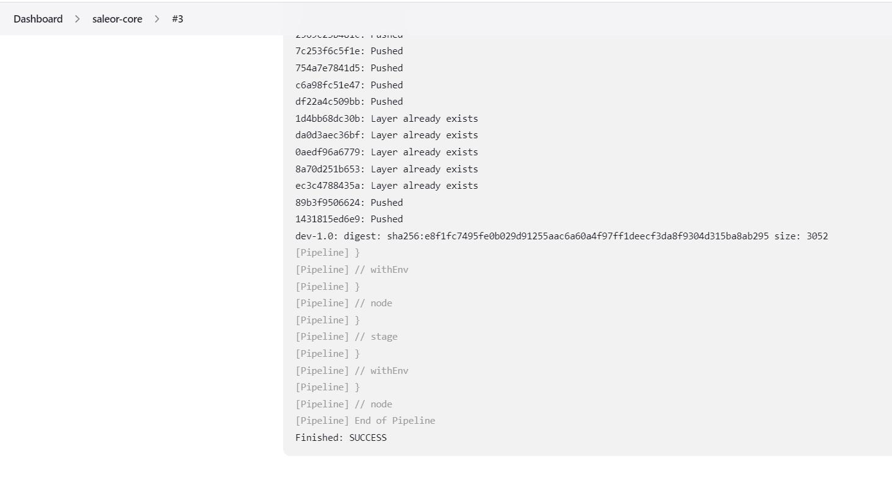


* To deploy it from K8s we need manifests:
------------------------------------------
* We need a volume which should persist for databases so creating a PersistentVolumeClaim and attach the volume to both the databases
 * Manifest for PVC:
  -----------------
```yaml
  ---
apiVersion: v1
kind: PersistentVolumeClaim
metadata:
  name: saleor-pvc
  labels:
    app: saleor
spec:
  selector:
    matchLabels:
      app: saleor
  storageClassName: gp2
  accessModes:
    - ReadWriteMany
  volumeName: mysqlvol
  resources:   
    requests:
      storage: 10Gi      
```
   * For redis cache databse:
     -------------------------
         * Manifest written for redis database deployment
```yaml
---
apiVersion: apps/v1
kind: Deployment
metadata:
  labels:
    db: redis
  name: redis
spec:
  minReadySeconds: 5
  replicas: 1
  selector:
    matchLabels:
      name: redis
  strategy:
    type: RollingUpdate
    rollingUpdate: 
      maxSurge: 25%
      maxUnavailable: 25%     
  template:
    metadata:
      name: redis
      labels:
        name: redis
    spec:
      containers:
        - image: library/redis:5.0-alpine
          name: redis-db
          ports:
            - containerPort: 6379
              protocol: TCP
          volumeMounts:
            - mountPath: /data
              name: redis-pvc    
      volumes: 
        - name: redis-pvc
          persistentVolumeClaim:
            claimName: saleor-pvc                
```

* Manifest written for redis db service
```yml
---
apiVersion: v1
kind: Service
metadata:
  labels:
    db: redis-db
  name: redis  
spec:
  type: ClusterIP
  ports:
    - port: 6379  
      protocol: TCP
      targetPort: 6379
  selector:
    name: redis  
```

* Manifest for postgres database deployment:
--------------------------------------------
```yaml
---
apiVersion: apps/v1
kind: Deployment
metadata:
  labels:
    db: psg
  name: postgres
spec:
  minReadySeconds: 5
  replicas: 1
  selector:
    matchLabels:
      name: postgres
  strategy:
    type: RollingUpdate
    rollingUpdate: 
      maxSurge: 25%
      maxUnavailable: 25%     
  template:
    metadata:
      name: postgres
      labels:
        name: postgres
    spec:
      containers:
        - image: library/postgres:13-alpine
          name: postgres-db
          ports:
            - containerPort: 5432
              protocol: TCP
          volumeMounts:
            - mountPath: /var/lib/postgresql/data
              name: postgres-pvc    
      volumes: 
        - name: postgres-pvc
          persistentVolumeClaim:
            claimName: saleor-pvc                
```

* Manifest for postgres db service:
-----------------------------------
```yaml
---
apiVersion: v1
kind: Service
metadata:
  labels:
    db: psg-db
  name: postgres  
spec:
  type: ClusterIP
  ports:
    - port: 5432  
      protocol: TCP
      targetPort: 5432
  selector:
    name: postgres
```

* Finally the saleor application
   * deployment Manifest 
```yaml
---
apiVersion: apps/v1
kind: Deployment
metadata:
  labels:
    app: saleor-core
  name: saleor-core
spec:
  minReadySeconds: 5
  replicas: 1
  selector:
    matchLabels:
      name: saleor-core
  strategy:
    type: RollingUpdate
    rollingUpdate: 
      maxSurge: 25%
      maxUnavailable: 25%     
  template:
    metadata:
      name: redis
      labels:
        name: saleor-core
    spec:
      containers:
        - image: tarunkumarpendem/saleor-core:dev-1.0
          name: saleor-core
          ports:
            - containerPort: 8000
              protocol: TCP        
```
  * Saleor application service
```yaml
---
apiVersion: v1
kind: Service
metadata:
  labels:
    app: saleor-core
  name: saleor-core  
spec:
  type: LoadBalancer
  ports:
    - port: 8000  
      protocol: TCP
      targetPort: 8000
  selector:
    name: saleor-core    
```
* Apply the manifests and check what they created
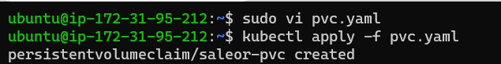
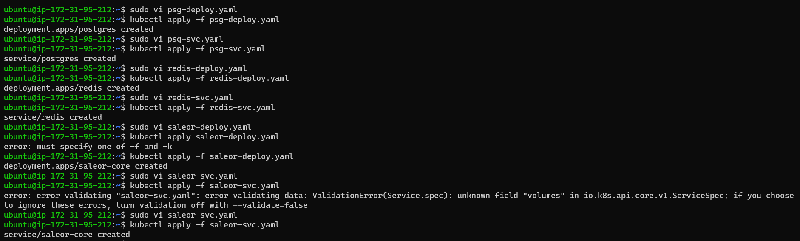
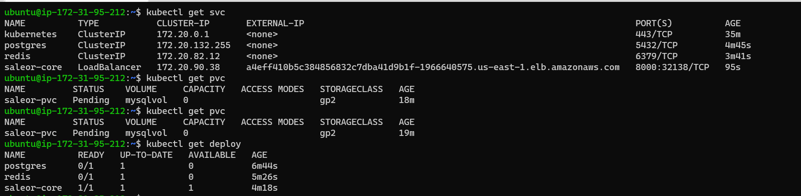

* Errors:
---------
* After successful creation i'm getting the following error
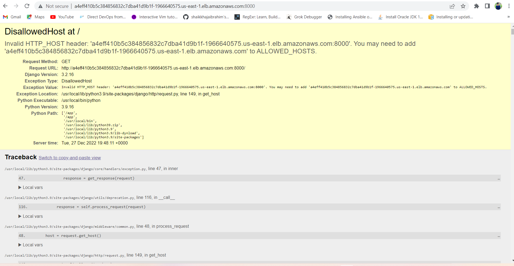
As of my knowledge it is beacuse of the database and application communication error.
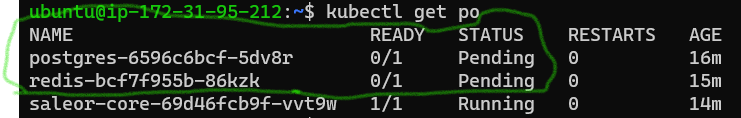
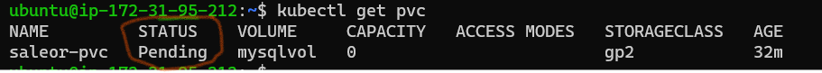
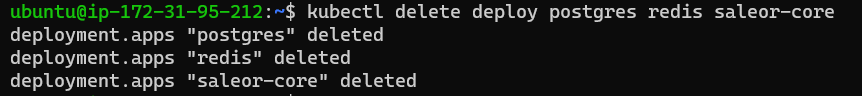